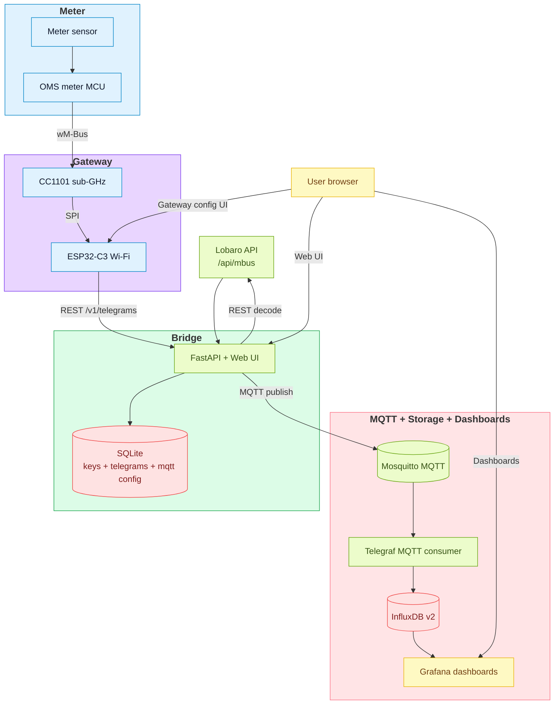
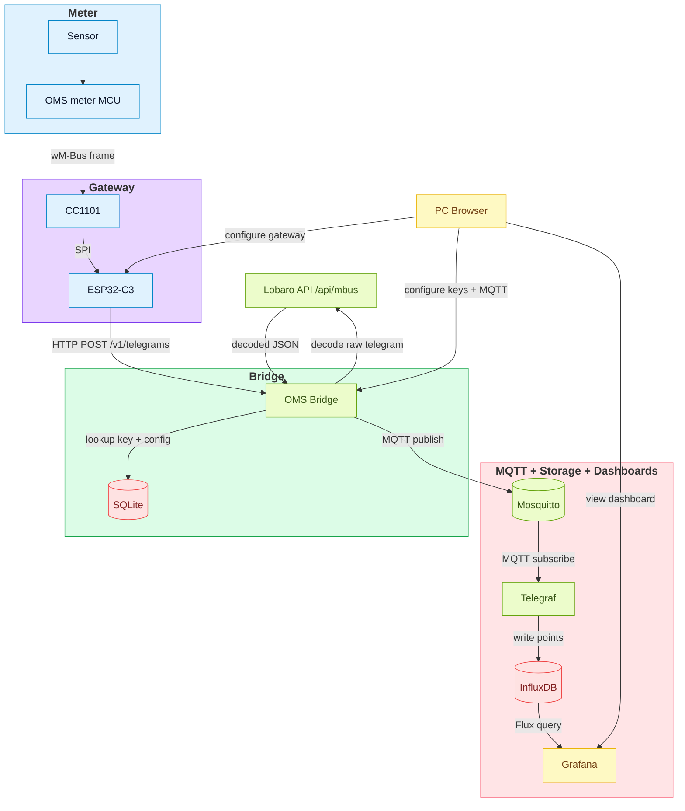

# OMS Parser Bridge


### System Overview


## Introduction

This repository contains the backend for the OMS bridge shown above. The FastAPI service accepts raw OMS telegrams from the gateway, resolves meter keys, forwards the payload to the Lobaro decoder, and publishes the decoded result to MQTT. It also exposes a minimal web UI and REST endpoints for configuring MQTT settings, managing meter keys, and reviewing recent telegrams stored in SQLite.

Minimal FastAPI service for wM-Bus/OMS telegrams.

- REST endpoint receives gateway telegrams.
- Telegrams are sent to the [Lobaro API](https://confluence.lobaro.com/display/PUB/wMbus+Parser).
- Successful decoding is published via MQTT.
- Static Web UI stores keys and MQTT config in SQLite.

## Components

- OMS meter + sensor: emits wM-Bus frames over 868MHz.
- Gateway (CC1101 + ESP32-C3): receives frames, posts JSON to `/v1/telegrams`, and exposes a browser UI for gateway configuration.
- OMS Bridge (FastAPI): validates input, resolves keys, calls Lobaro, publishes MQTT.
- Web UI: manages meter keys, MQTT config, and shows recent telegrams.
- SQLite: persists keys, pending meters, MQTT config, and telegram history.
- Mosquitto: MQTT broker for decoded telegram payloads.
- Telegraf: subscribes to MQTT topics and writes metrics to InfluxDB.
- InfluxDB: time-series storage for decoded measurements.
- Grafana: dashboards for visualization on the PC/browser.

## Dataflow (End-to-End)



## Run with Docker

```bash
docker compose -f docker/docker-compose.yml up --build
```

Web UI: `http://localhost:8000/ui/`
Health: `http://localhost:8000/healthz`

## Full Stack (MQTT + InfluxDB + Grafana)

```bash
docker compose -f docker/docker-compose.full.yml up --build
```

Services included:

- `oms-bridge` (FastAPI + Web UI)
- `mosquitto` (MQTT broker)
- `telegraf` (MQTT -> InfluxDB)
- `influxdb` (time-series storage)
- `grafana` (dashboards)

Grafana: `http://localhost:3000/` (admin/admin by default)
InfluxDB: `http://localhost:8086/`

Grafana is provisioned with an InfluxDB datasource and a starter dashboard under `docker/grafana/`.
Mosquitto and Telegraf use `docker/mosquitto.conf` and `docker/telegraf.conf`.

## Example docker-compose.yml

```yaml
services:
  oms-bridge:
    build:
      context: .
      dockerfile: docker/Dockerfile
    environment:
      LOBARO_TOKEN: "REPLACE_ME"
      KEYS_DB_PATH: "/data/keys.db"
      LOG_LEVEL: "INFO"
    volumes:
      - oms-keys:/data
    ports:
      - "8000:8000"

volumes:
  oms-keys:
```

## Run locally

```bash
python -m venv .venv
source .venv/bin/activate
pip install -e .
uvicorn app.main:app --reload
```

## Environment

Required:

- `LOBARO_TOKEN=...`

Optional:

- `LOBARO_TIMEOUT_S=10`
- `KEYS_DB_PATH=./keys.db`
- `LOG_LEVEL=DEBUG`
- `MQTT_URL=mqtt://broker:1883`
- `MQTT_USERNAME=...`
- `MQTT_PASSWORD=...`
- `MQTT_TOPIC_TEMPLATE=oms/v1/gw/{gateway_id}/meter/{meter_id}/reading`
- `MQTT_QOS=1`
- `MQTT_RETAIN=false`

Keys and MQTT config persist if `KEYS_DB_PATH` points to a mounted volume.

MQTT can be configured either via the Web UI or environment variables. If the database has no MQTT config yet, the service will bootstrap it from env on first start.

## REST: receive telegrams

`POST /v1/telegrams`

Example:

```bash
curl -X POST http://localhost:8000/v1/telegrams \
  -H "Content-Type: application/json" \
  -d '{
    "gateway": "OMS-Gateway-BCFC94",
    "status": 0,
    "rssi": -82.0,
    "lqi": 120,
    "manuf": 123,
    "id": "12345678",
    "dev_type": 2,
    "version": 1,
    "ci": 7,
    "payload_len": 24,
    "logical_hex": "2e4493157856341233037a2a0020"
  }'
```

## Web UI

Static files live under `app/static/`. The UI lets you:

- Set MQTT broker configuration (stored in SQLite)
- Manage meter keys (SQLite) without exposing them in the UI
- Switch between light and dark theme

New meters without a key appear in a pending list with an "Add" action.

Known meters show the forwarded telegram count. Clicking a meter opens a minimalist viewer of the latest telegrams, including input and parsed output.

## Screenshots

| UI |
| --- |
|  |
| Pending meters view |

| Add Meter Key View |
| --- |
|  |
| Add / enter a meter key |

| UI |
| --- |
|  |
| Known meters view |

| Meter Telegram Details |
| --- |
|  |
| Telegram details (token missing example) |

MQTT configuration can be managed in the Web UI or provided via environment variables. If env values are set, the UI will show them as locked.
