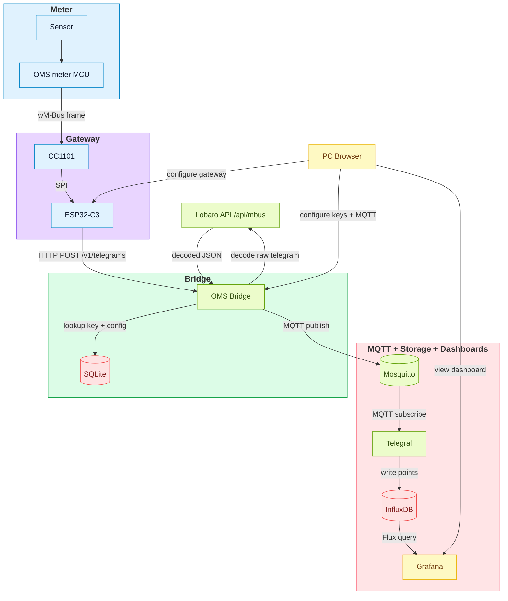

# OMS Bridge

OMS Bridge is a FastAPI service that accepts wM-Bus/OMS telegrams from a gateway, resolves meter keys, sends the payload to the Lobaro API for decoding, and publishes decoded results to MQTT. It includes a minimal web UI for key and MQTT configuration and an optional full stack (Mosquitto, Telegraf, InfluxDB, Grafana) for dashboards.

## Highlights

- REST ingest endpoint for gateway telegrams.
- Key management and MQTT configuration via web UI.
- SQLite storage for keys, pending meters, MQTT config, and telegram history.
- MQTT publish of decoded results (topic template supported).
- Optional full stack for time-series storage and dashboards.

### Dataflow (End-to-End)



## Components

- Meter: sensor + OMS meter MCU emitting wM-Bus frames.
- Gateway: CC1101 + ESP32-C3, posts JSON to `/v1/telegrams`, and provides a browser UI for gateway configuration.
- OMS Bridge: FastAPI backend + Web UI for keys, MQTT config, and telegram viewer.
- SQLite: stores keys, pending meters, MQTT config, and telegram history.
- Mosquitto: MQTT broker for decoded telegram payloads.
- Telegraf: MQTT consumer that writes points to InfluxDB.
- InfluxDB: time-series storage for decoded measurements.
- Grafana: dashboards in the browser.

## Quickstart (Bridge Only)

```bash
docker compose -f docker/docker-compose.yml up --build
```

- Web UI: `http://localhost:8000/ui/`
- Health: `http://localhost:8000/healthz`

## Full Stack (MQTT + InfluxDB + Grafana)

```bash
docker compose -f docker/docker-compose.full.yml up --build
```

Included services:

- `oms-bridge` (FastAPI + Web UI)
- `mosquitto` (MQTT broker)
- `telegraf` (MQTT -> InfluxDB)
- `influxdb` (time-series storage)
- `grafana` (dashboards)

Endpoints:

- Grafana: `http://localhost:3000/` (admin/admin by default)
- InfluxDB: `http://localhost:8086/` (oms/oms-password by default)

### Full stack config files

- [`docker/mosquitto.conf`](docker/mosquitto.conf): enables auth and persistence for MQTT.
- [`docker/telegraf.conf`](docker/telegraf.conf): subscribes to `oms/v1/gw/+/meter/+/reading` and writes JSON payloads to InfluxDB.
- [`docker/grafana/provisioning/datasources/influxdb.yml`](docker/grafana/provisioning/datasources/influxdb.yml): InfluxDB datasource (org `oms`, bucket `oms`, token `oms-token`).
- [`docker/grafana/provisioning/dashboards/dashboards.yml`](docker/grafana/provisioning/dashboards/dashboards.yml): dashboard loader.
- [`docker/grafana/provisioning/dashboards/oms-telemetry.json`](docker/grafana/provisioning/dashboards/oms-telemetry.json): starter temperature dashboard.

### Grafana dashboard customization

The starter dashboard query filters by:

- `gateway_id`
- `meter_id`
- `topic`
- `host` (Telegraf container hostname)
- `_field` (example: `lobaro_Body_DataRecords_4_ValueScaled`)

If you use different gateway or meter IDs, update those filters in `docker/grafana/provisioning/dashboards/oms-telemetry.json`. If the host is different, change or remove the `host` filter. The topic filter must match your MQTT topic template.

## Configuration

Required:

- `LOBARO_TOKEN=...`

Optional:

- `LOBARO_TIMEOUT_S=10`
- `KEYS_DB_PATH=./keys.db`
- `LOG_LEVEL=DEBUG`
- `MQTT_URL=mqtt://broker:1883`
- `MQTT_USERNAME=...`
- `MQTT_PASSWORD=...`
- `MQTT_TOPIC_TEMPLATE=oms/v1/gw/{gateway_id}/meter/{meter_id}/reading`
- `MQTT_QOS=1`
- `MQTT_RETAIN=false`

Keys and MQTT config persist if `KEYS_DB_PATH` points to a mounted volume.

MQTT can be configured via the Web UI or environment variables. If env values are set, the UI shows them as locked.

## REST API

`POST /v1/telegrams`

Example:

```bash
curl -X POST http://localhost:8000/v1/telegrams \
  -H "Content-Type: application/json" \
  -d '{
    "gateway": "OMS-Gateway-BCFC94",
    "status": 0,
    "rssi": -82.0,
    "lqi": 120,
    "manuf": 123,
    "id": "12345678",
    "dev_type": 2,
    "version": 1,
    "ci": 7,
    "payload_len": 24,
    "logical_hex": "2e4493157856341233037a2a0020"
  }'
```

## Web UI

Static files live under `app/static/`. The UI lets you:

- Configure MQTT broker settings (stored in SQLite).
- Add and delete meter keys (keys are not shown after entry; must be 32 hex chars).
- View pending meters and recent telegrams.
- Switch between light and dark theme.

## Screenshots

| UI |
| --- |
|  |
| Pending meters view |

| Add Meter Key View |
| --- |
|  |
| Add / enter a meter key |

| UI |
| --- |
|  |
| Known meters view |

| Meter Telegram Details |
| --- |
|  |
| Telegram details (token missing example) |
