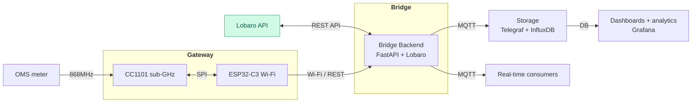
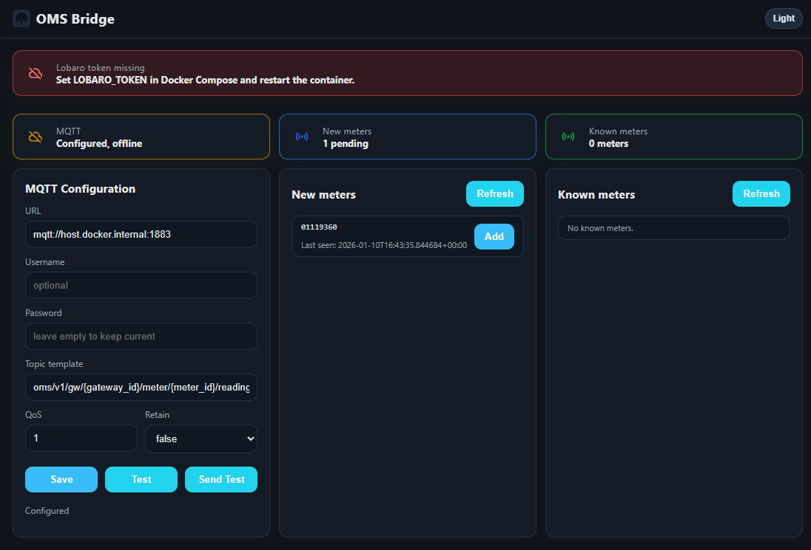
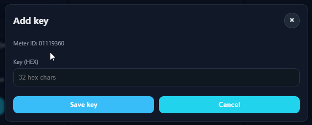
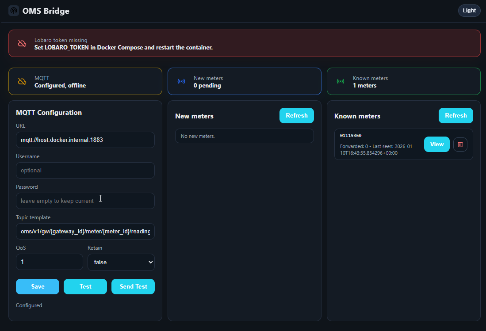
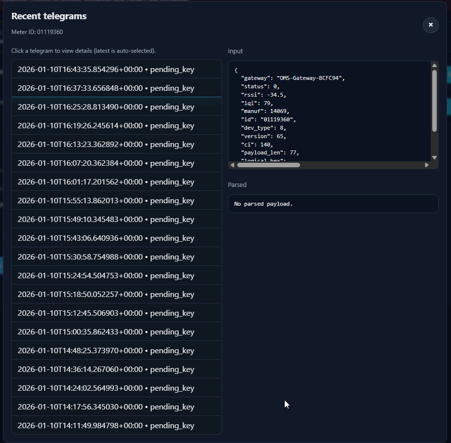

# OMS Parser Bridge


### System Overview


## Introduction

This repository contains the backend for the OMS bridge shown above. The FastAPI service accepts raw OMS telegrams from the gateway, resolves meter keys, forwards the payload to the Lobaro decoder, and publishes the decoded result to MQTT. It also exposes a minimal web UI and REST endpoints for configuring MQTT settings, managing meter keys, and reviewing recent telegrams stored in SQLite.

Minimal FastAPI service for wM-Bus/OMS telegrams.

- REST endpoint receives gateway telegrams.
- Telegrams are sent to the [Lobaro API](https://confluence.lobaro.com/display/PUB/wMbus+Parser).
- Successful decoding is published via MQTT.
- Static Web UI stores keys and MQTT config in SQLite.

## Run with Docker

```bash
docker compose -f docker/docker-compose.yml up --build
```

Web UI: `http://localhost:8000/ui/`
Health: `http://localhost:8000/healthz`

## Example docker-compose.yml

```yaml
services:
  oms-bridge:
    build:
      context: .
      dockerfile: docker/Dockerfile
    environment:
      LOBARO_TOKEN: "REPLACE_ME"
      KEYS_DB_PATH: "/data/keys.db"
      LOG_LEVEL: "INFO"
    volumes:
      - oms-keys:/data
    ports:
      - "8000:8000"

volumes:
  oms-keys:
```

## Run locally

```bash
python -m venv .venv
source .venv/bin/activate
pip install -e .
uvicorn app.main:app --reload
```

## Environment

Required:

- `LOBARO_TOKEN=...`

Optional:

- `LOBARO_BASE_URL=https://platform.lobaro.com`
- `LOBARO_TIMEOUT_S=10`
- `KEYS_DB_PATH=./keys.db`
- `LOG_LEVEL=DEBUG`

Keys and MQTT config persist if `KEYS_DB_PATH` points to a mounted volume.

## REST: receive telegrams

`POST /v1/telegrams`

Example:

```bash
curl -X POST http://localhost:8000/v1/telegrams \
  -H "Content-Type: application/json" \
  -d '{
    "gateway": "OMS-Gateway-BCFC94",
    "status": 0,
    "rssi": -82.0,
    "lqi": 120,
    "manuf": 123,
    "id": "12345678",
    "dev_type": 2,
    "version": 1,
    "ci": 7,
    "payload_len": 24,
    "logical_hex": "2e4493157856341233037a2a0020"
  }'
```

## Web UI

Static files live under `app/static/`. The UI lets you:

- Set MQTT broker configuration (stored in SQLite)
- Manage meter keys (SQLite) without exposing them in the UI
- Switch between light and dark theme

New meters without a key appear in a pending list with an "Add" action.

Known meters show the forwarded telegram count. Clicking a meter opens a minimalist viewer of the latest telegrams, including input and parsed output.

## Screenshots

| UI |
| --- |
|  |
| Pending meters view |

| Add Meter Key View |
| --- |
|  |
| Add / enter a meter key |

| UI |
| --- |
|  |
| Known meters view |

| Meter Telegram Details |
| --- |
|  |
| Telegram details (token missing example) |

MQTT configuration is managed only via the Web UI (not via environment variables).
